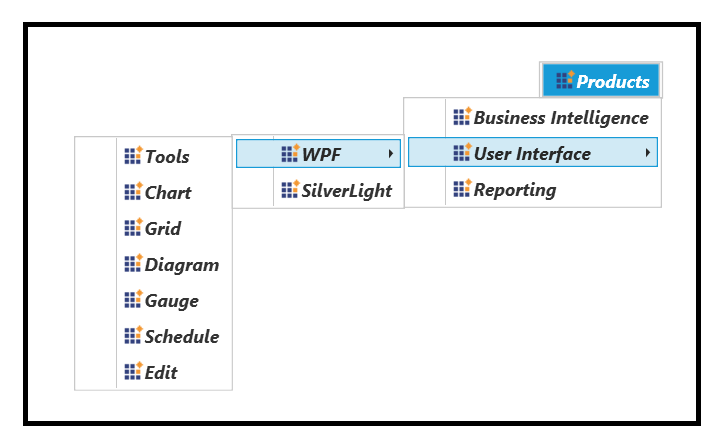

# How to customize data templates for WPF MenuAdv?

This sample loads [MenuAdv](https://help.syncfusion.com/wpf/menu/getting-started) and [Chromeless Window](https://help.syncfusion.com/wpf/chromeless-window/getting-started) with Item templates that shows how to customize the appearance of MenuItemAdv.

